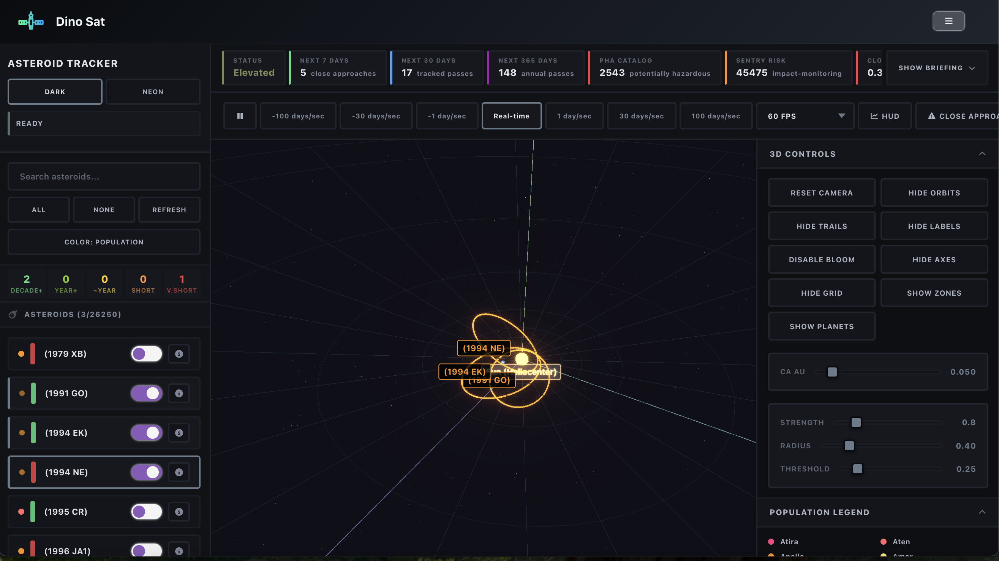
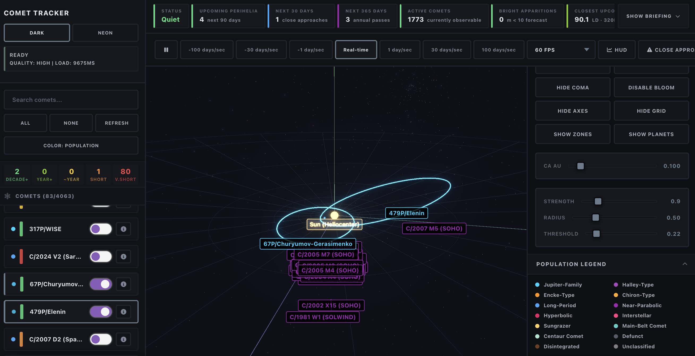
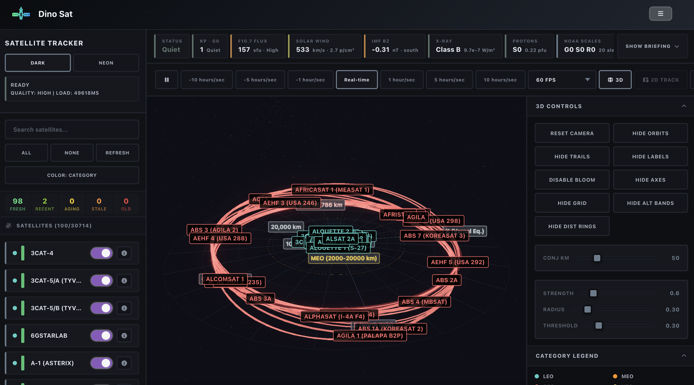
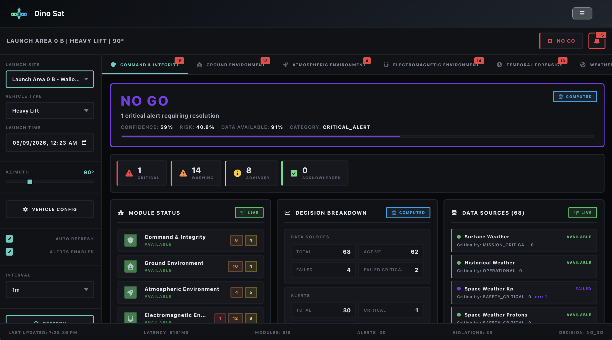
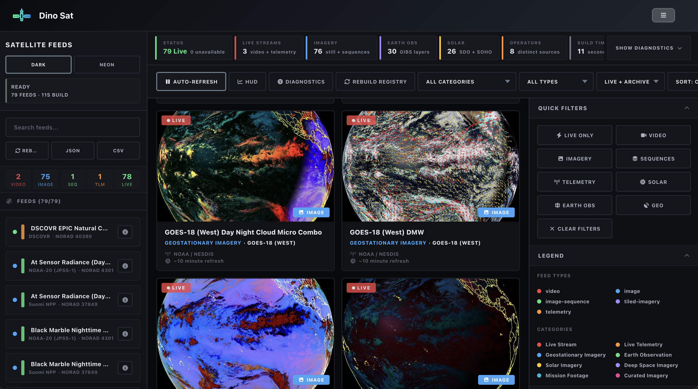
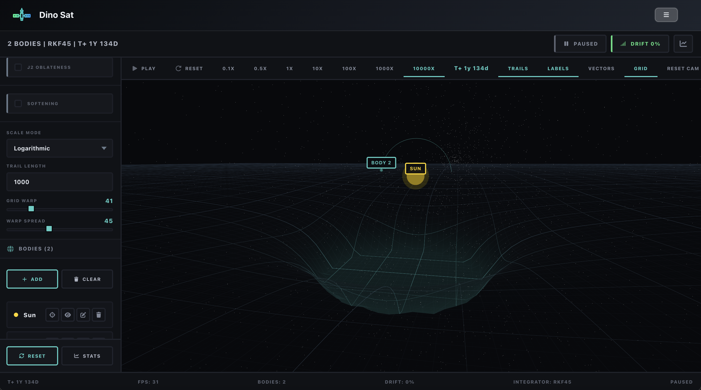

# DinoSat

A space situational awareness platform. DinoSat is a single web app for tracking the things that move through near-Earth space and the inner solar system: active satellites, asteroids, comets, launch weather, live spacecraft telemetry, arbitrary n-body systems, and an astronomical reference database. Seven pages, three product categories, one heliocentric worldview, a lot of orbital mechanics happening under the hood.

As a disclaimer, I am not a physicist. Much like my other open source platforms, this is a for-fun learning project. Math may not be perfect in some places. Feedback is always welcome. 

This is a personal-scale platform built because the existing tools for this stuff are either Cold War era government dashboards, paywalled aerospace software, or toy demos. DinoSat sits somewhere in the middle: real propagators, real ephemerides, real conjunction math, wrapped in a UI that is fun to use and pretty to look at. 

Hosted at **[DinoSat](https://dino-sat.vercel.app/login)**. Account creation, sessions, and team management are handled through Dino Auth (see below).

**Stack:** React + Vite + Three.js on the frontend, Node.js + Express + PostgreSQL on the backend.

---

## Screenshots

| Asteroid Tracker | Comet Tracker | Satellite Tracker |
|:---:|:---:|:---:|
|  |  |  |

| Earth Conditions | Satellite Feeds | N-Body Simulator |
|:---:|:---:|:---:|
|  |  |  |

---

## The Pages

The pages in the DinoSat platform are separated into three categories: trackers for live viewing and cataloging of moving bodies, monitors for real-time assessment from available data sources, and simulators as sandboxed physics platforms. Additionally there is a standalone lookup page for celestial objects and phenomena. 

### Trackers

#### Asteroid Tracker
This page features a heliocentric Three.js scene that renders tens of thousands of asteroid orbits sourced from the JPL Small-Body database. The backend sends twelve parallel queries to the SBDB that work together to aggregate data about many different kinds of asteroids (PHA, Atira, Aten, Apollo, Amor, Mars-crossing, Inner Main Belt, Main Belt, Outer Main Belt, Jupiter Trojans, Centaurs, TNO) behind  shared-fetch-fan-out pattern. This involves several SSE subscribers attached to a single inflight fetch. This ensures that concurrent page loads wont duplicate traffic upstream. Circuit breakers on JPL SBDB, NeoWs/CAD, and CNEOS Sentry APIs are used to monitor consecutive failures, and initiate transitions between closed/half-open/open states on those APIs. This also allows it to enforce cooldown timers before retrying the APIs again. Exponential backoff is used here as well. I've implemented a concurrency limiter to cap parallel upstream requests at 4 requests max. there are six independent cache layers all of which which have separate TTLs  (asteroid catalog 6h, NEO Watch 15m, Gemini dossiers 24h, observation data 1h, Sentry 1h, population census 6h), designed to keep the page responsive between refreshes, with LRU eviction at 500 entries on the Gemini and observation caches. 

Streaming ingest over SSE lets me push the asteroid batches into the scene when they arrive at the frontend so the page can stop loading prior to the arrival of the full asteroid catalog. Each individual asteroid is classified into one of 14 different categories (Atira through KBO plus Comet and Unclassified) using a two-pass classifier: first by the JPL orbit class code if that is available for the asteroid, then by the orbital-element geometry (semi-major axis, eccentricity, periheliion, aphelion). All the derived quantities are computed client-side on each of the objects. these nclude the orbital period, angular momentum, Tisserand parameter with respect to Jupiter, Ramanujan approximation for orbit circumference, heliocentric longitude of the perihelion, and Earth/Mars/Jupiter crossing flags. The observation arc quality is derived from the first and last observation dates for each individual asteroid and i can then map this to a five-tier color scale (multi-decade, multi-year, year-class, short, very short) and gthis will appear as a badge on each asteroid's side bar entry.

The visualization is built in Three.js and it renders all of the asteroid bodies as instanced meshes. Each of these meshes has a per-instance coloration, plus a matching glow shell. I run Frustum culling on every other frame with a margin that is user-configurable with a distance cap at 6k units. the asteroids are sorted by distance and capped at the visibility limit. Orbit lines are drawn for each of the asteroid using Line2/LineGeometry/LineMaterial and they are auto-rebuilt on half-period elapsed or time-direction reversal. Buffers are accumulated by collecting the position samples over time for the asteroid trails, and their LineGeometry is rebuilt in place. I use two-body Kepler propagation with Newton-Raphson on the Kepler equation to find the elliptical orbits of the asteroids, and a separate hyperbolic Kepler solver has been implemented for solving the unbounded trajectories. To get the position of the Earth, a truncated VSOP-like analytic series used to determine the ecliptic longitude and the radius.  Within the visualization, all of the asteroids and their labels sit on top of a radial grid with concentric rings and reference axes for the Vernal Equinox, Ecliptic North, and 90° ecliptic longitude, each of which are rendered as a line through the center. The boundaries for the inner system, outer system, and the main asteroid belt are also marked on top of the grid as well as orbital distance rings for all of the eight planets in the solar system. In the background of the scene, a GLSL vertex-shaded star field is rendered (not accurate to actual star positions) with spectral color variation and twinkle created by shifting the star size that is modulated by position hash. Bloom post-processing is also implemented for the visualization, with three parameters that are user-configurable (strength, radius, and threshold), as well as ACES filmic tone mapping. There are also built in controls for bidirectional time (simulate future or past positions), as well as FPS. 

When you click on any of the available asteroids within the visualization or on the sidebar, a dossier with gathered information specific to that asteroid will open up. the orbital tab will show all of the Keplerian elements for the asteroid in question including the derived mechanics of the asteroid, made up of the the Tisserand parameter, MOID analysis with severity tiering, the orbit circumference, and all of the crossing flags. the tab also contains a live state vector that will show the heliocentric ecliptic position and distance, as well as the distance to Earth and the Moon in AU. It will also show some gathered, basic info on operational implications. the AI brief tab will trigger a Gemini pipeline on the backend that is built in three distinct stages. Stage 1 will extract the provenance of the discovery and a physical property fact sheet with Google searches. Stage 2 will generate a narrative analysis that includes an executive summary, scientific contribution, potential resources, population family context, etc. Stage 3 produces a timeline of notable events in the history of the asteroid and a six-domain risk-assessment (orbit arc, impact risk, close approach, operational risk, mission window, and regulatory). Each of these three stages runs with an independent 25-second timeout; partial results will surface even is later stages fail. Token usage is reported per stage for tracking. The observations tab creates a summary using the Wikipedia REST API and JPL SBDB lookup, called in parallel. It will display the physical properties of the asteroid in question including the diameter, albedo, rotation period, spectral type, and GM. It will also show recorded approaches with the distance and relative velocity, as well as links to go straight to the source that any of this information was gathered from. the flyby predictions tab will propagate the asteroid's Kepler orbit against the analytic position of the Earth over a user-configured time window. it will plot the distance-vs-time on a canvas chart with a PHA threshold of 0.05 AU. the closest approach epoch will be reported in several different units. the observer geolocation is also configurable manually and will otherwise be set by the broswer gathered location of the user. the orbit arc tab shows the observation arc quality class, the number of observations recorded, the estimated position error envelopes at +1y and +10y, and the raw orbital elements. 

The close approach detection runs across the full catalog of asteroids, not just the ones that are seen in the visualization, on a 5-second interval.A minimum orbital intersection distance (MOID) pre-filter with a 1.5x threshold selects a set of candidates asteroids from the catalog whose orbital geometry permits a close approach, then the propagated positions of those candidates are tested against the analytic position of the Earth. I've implemented several hardcoded tiers that include Critical (<0.0027 AU), High (0.0027-0.01 AU), Moderate (0.01-0.025 AU), and Low (0.025-threshold). These close approaches can be viewed in a searchable and filterable panel that alos has user-configurable thresholds to adjust the severity tiers. 

The NEO watch system is designed to aggregate all of the collected data from three upstream APIs on a 15-minute refresh cycle. these three upstream APIs include JPL Close Approach Data for 7, 30, and 265 day windows, CNEOS Sentry which does impact-monitoring, and the asteroid catalog for all of the PHA counts. and recent discoveries. Using the aggregated data from these three sources, an overall severity score (0-6) is computed from Torino scale maximums, Palermo scale thresholds, and the approach density. On the frontend, the NEO watch strip will display the surface status, approach counts, PHA catalog size, Sentry risk count, closest upcoming pass, and recent discovery count. The detail tab for any individual NEO has six sub-tabs including an overview with statistics and and imminent approaches table, an upcoming passes tab, a Sentry risk tab that includes the CNEOS Sentry table with the methodology information for the Palermo and Torino methods, a recent discoveries tab, a risk matrix that takes into account t-domains (planetary defense, mission targets, resource prospecting, Earth observation, and scientific survey), and lastly an AI analysis tab using the three-staged Gemini pipeline previously described. 

A population census panel calculates all of the per-category statistics including the tracked count, estimated total, coverage percentage, PHA/NEO counts, mean semi-major axis, and mean eccentricity fro the thirteen population groups with currently hardcoded estimated total baselines for coverage calculation. It contains three views for population group cards with coverage charts, aggregated statistics, and a comparison matrix table. 

#### Comet Tracker
This page features roughly the same architecture as the asteroid tracker page, simply rebuilt to display comets instead of asteroids. The backend performs 9 simultaneous queries on the JPL SBDB, focusing on different types of comets: All Comets, Jupiter-Family, Jupiter-Family Numbered, Halley-Type, Encke-Type, Chiron-Type, Hyperbolic, Parabolic, and those with distant activity where the perihelion is greater than 3 AU. The system uses the same shared-fetch approach alongside circuit breakers and retries froim the asteroid backend architecture, all designed to limit the number of tasks running at the same time. It has six separate cache layers that follow a consistent time-to-live (TTL) structure. Comets collected are divided into 14 categories: Jupiter-Family, Halley-Type, Encke-Type, Chiron-Type, Long-Period, Near-Parabolic, Hyperbolic, Interstellar, Sungrazer, Main-Belt Comet, Centaur Comet, Defunct, Disintegrated, and Unclassified. To sort the comets, we use a two-step classification system. First, we look at the JPL orbit class code. Then, we examine their orbital characteristics, which include the comet's period, eccentricity, and distance at perihelion. For sungrazers and interstellar objects, we also perform a full name string match.The activity status of the comet (Active, Dormant, Disintegrated, Lost, Unknown) can be inferred from the full name prefix (D/ for disintegrated), last observation recency, and its orbital properties. The apparition count is estimated from the ibservation arc length divided by the orbital period for the bound comets. The streaming ingest is the same as the one used in the asteroid tracker. 

The orbital propagator has three branches designed to handle elliptical, parabolic, and hyperbolic trajectories with the correctly chosen solver for each conic section. The elliptical orbits Newton-Raphson on the Kepler equation with the mean anomaly being computed from either the epoch plus the mean anomaly or from the time of perihelion. Whichever is available. The parabolic orbits (eccentricity within 1e-4 of 1.0) use Barker's equation solved using the cubic-root closed form. The hyperbolic orbits use the hyperbolic variant of the Kepler equation with a log-informed initial guess. The propagator computes the semi-major axis from perihelion distance when `a` isn't provided and vice versa. This handles the mixed element sets that are common in the returns from JPL SBDB for different comet classes. All the comets that have unbounded orbits render their orbit lines by sampling a configurable timespan that is scalable to the perihelion distance rather than a full period. 

The visualization is created in Three.js, similar to the asteroid tracker, and renders the comet bodies as instanced meshes with per-mesh color variation based on the comet's category and a second instanced mesh surrounding for the coma shell, which is an additive-blended back-face sphere whose scale is informed by an activity proxy that is computed as 1/rH^2.5 (where rH is the live heliocentric distance in AU). This way, the comets that are near perihelion will display visibly larger and brighter comas than those that are in the outer system. The come color will shift toward a warmer white at high activity levels. the coma layer, like the orbital lines and trails, are toggleable on and off. All of the other scene infrastructure including the frustum culling, orbit lines, tail buffers, ecliptic radial grid with concentric lines, orbital zones, distance rings, star field, bloom, tone mapping, bidirectional time propagation, and FPS throttling, are all identical to the asteroid tracker visualization previously described. 

The close approach detection however, uses a different methodology than the asteroid tracker. Instead of detailing the instantaneous propagated positions, it will sample each comet's trajectory at 60 different points across a year-long forward window, propagate earth's position at each of these samples, and find the minimum distance per comet. This will handle the fact that cometary close approaches are often very brief transients during the perihelion pass that a single-epoch snapshot would almost certainly miss. MOID pre-filtering threshold is at 30x the configured approach threshold (vs 1.5x fro asteroids) because the cometary orbits are a lot less predictable. the severity tiers are a lot wider than the asteroid tracker: Critical (<0.005 AU), High (0.005-0.05 AU), Moderate (0.05-0.1 AU), Low (0.1-threshold).

Clicking on any of the comets in the side bar or visualization will open up a dossier similar to the one in the asteroid tracker. The orbital tab will show all of the cometary elements including the perihelion q, time of perihelion Tp, eccentricity, inclination, RAAN, argument of the perihelion, and semi-major axis where applicable. Additionally it will show. the derived mechanics of the comet in question, including the Tisserand parameter with a family label, the orbit circumference of the comet, the crossing flags, and a sungrazer/interstellar classifier. It will also a show an activity and brightness section, displaying the classifiers (M1, K1, M2, K2), the non-gravitational params (A1/A2/A3), the activity status of the comet, the live activity proxy, and the live apparent magnitude, as well as the hazard geometry, identify and provenance of discovery,  a live state vector, and the operational implications with Tisserand classification. the AI brief tab will use the previously described three-stage Gemini pipeline to generate the AI report on the comet that will include comet specific properties including the nucleus properties, composition class, dust and gas production rates, fragmentation history, the Kreutz/Marsden/Meyer family membership, and Oort cloud vs Kuiper Belt source attribution. The observations tab will fetch the Wikipedia and JPL SBDB summary of the comet and its specific properties and external references including the Cometary Activity Database. the flyby predictions tab will propagate distance-vs-time for the comet in question and compute an apparent magnitude forecast curve, using the M1/K1 formula. This is plotted next to the distance curve with a naked-eye threshold line at m=6. Additionally this tab will report the comet's peak brightness epoch, magnitude, and visibility class (naked eye/binoculars/telescope/CCD only). The orbit arc tab will show the same quality assessment s the asteroid tracker with the one addition being the non-gravitational acceleration parameters (A1/A2/A3) with larger default error envelope estimated (5x the asteroid tracker values) to reflect the added uncertainty from outgassing. 

The comet watch system is the comet tracker equivalent of the NEO watch system in the asteroid tracker.The system gathers all the data from the JPL CAD API, specifically focusing on comets (with the filter set to kind=c) over two timeframes: 30 days and 365 days. It then checks the catalog for upcoming perihelion passes within the next 90 days. The process involves counting how many comets are currently active and identifying those that cross the Earth's path. Additionally, it predicts all potential bright appearances of these comets, using the standard formula for comet brightness: m = M1 + 5*log10(delta) + K1*log10(rH). In this formula, K1 is often set to 10 when there isn’t a slope parameter available. The overall severity scoring takes into account the perihelion count, the forecast for bright apparitions, and the distance at closest approach. The detail panel once again contains six different tabs including an overview tab with the imminent perihelion passages table, an upcoming perihelia tab, a close approaches tab with methodology cards that go over the non-gravitational forces and comet-specific hazards, a recent discoveries tab, and a 5-domain risk matrix tab (covering planetary defense, mission targets, astronomy/observation, Earth observation, and scientific survey), as well as an AI analysis tab that uses the previously described three-stage Gemini pipeline. 

#### Satellite Tracker
This page is structured very similarly to the asteroid and comet trackers, but pivoted to provide tracking for satellites in LEO, MEO, and GEO. While scaffolding is the same as the comet and asteroid trackers, it is rebuilt against a geocentric ECI frame with SGP4/SDP4 propagation, real-time space weather coupling, and a six-tab per satellite dossier. The backend is integrated with two upstream providers: CelesTrak by default (single GP active catalog endpoint) and Space-Track when the credentials are present (3LE format, decay-date null filter, 30-day epoch window). Switching ebtwen these providers is automatic based on which environment variables are present. All of the Space-Track requests run through a circuit breaker (3-failure threshold, 5-minute open cooldown period, 60-second half-open recovery, session cookie cached for an hour) with breaker state, consecutive failure tracking, and total request and failure totals exposed via the health endpoint. The catalog ingestion reuses the same shared fetch fan-out as the asteroid and comet trackers, involving multiple SSE subscribers attaching to a single inflight fetch and receiving the partial accumulation buffer immediately, so concurrent page loads don't duplicate any upstream traffic. It also uses five separate cache layers with separate TTLs (catalog 2h5m, space weather 5m, mission intelligence 24h with LRU 500, observation data 30m with LRU 500, space weather AI 30m). 

The TLE parser is responsible for validating the checksum digits on both lines, as well as rejecting malformed records, computing the epoch data from the YYDDD.DDDDDDDD, and then decoding the BSTAR drag term from its packed mantissa-exponent representation, and lastly deriving semi-major axis, altitude, and orbital period from mean motion. Each of. the collected satellites is classified into one of 17 categories (LEO, MEO, GEO, HEO, Deep Space, Starlink, OneWeb, Military, Weather, Communication, Navigation, Scientific, Debris, CubeSat, Amateur, Earth Observation, Spy/Reconnaissance) using a two-pass classifier: first by pattern matching the name for debris and rocket bodies, then by altitiude and eccentricity geometry. the group inference layers are a second classification on top separating the different constellations and groups by name pattern. The propagation models I've implemented here are selected for each satellite: SGP4 for satellites with periods under 225 minutes, SDP4 for deep-space-class orbits above that threshold. The TLE age can then be calculated from the epoch data for each satellite and mapped to a tiered color scale (fresh under 1 day, recent 1-3 days, aging 3-7 days, stale 1-2 weeks, very stale over 2 weeks) that is displayed in the controls panel on the frontend. The streaming ingest is the same as the one used in the asteroid and comet trackers. 

The visualization scene here is built in Three.js, just like the comet and asteroid trackers, and reuses the core of their architectural foundation. This includes all of the considerations of the previous trackers including frustum culling, orbit lines, tail buffers, ecliptic radial grid with concentric lines, orbital zones, distance rings, star field, bloom, tone mapping, bidirectional time propagation, and FPS throttling. In this tracker, however, it is rebuilt using an Earth-centered inertial frame. The trail ring buffers in this instantiation of the architecture hold 30 samples each, and per-satellite SGP4 propagator records are cached in a map keyed by the satellite ID and constructed lazily from TLE on first access. The eclipse geometry I've implemented here can be calculated in the Earth-Sun frame as the intersection between cones, where the umbra and the penumbra cone half-angles are calculated by using the Sun and Earth radii at 1 AIU. Then, I can compare the local cone radius at its projected depth behind Earth, to the satellite's perpendicular distance.  Using this method, the penumbra entry will to produce a smooth shadow factor between 0.15 and 1.0 to represent a full penumbra to full sunlight, and this will make the per-instance brightness of the meshes variable. This can be extended to calculate the direction of the sun using a VSOP-like analytic series, just the star field does. This is done by calculating the solar ecliptic longitude, transforming the calculated longitude to ECI through obliquity, and deriving the directional light and the GLSL shader on the inner atmosphere, which is going to paint the day/night terminator with gradients for sunset, twilight, and night, as well as a Fresnel rim. the rotation fo the Earth is derived from GMST when the EOP feed is successful and it will rotate correctly no matter the selected time direction. While the grid and reference lines are the same structure as the comet and asteroid tracker, in this instantiation we are showing altitude bands  (LEO 200-2000 km, MEO 2000-20000 km, GEO 35000-36500 km with a shaded ring at the geostationary belt) and hardcoded, labeled distance rings at 500/1000/2000/5000/10000/20000/35786 km. 

The space weather strip across the top fo the frontend visualization will show the NOAA SWPC feeds in real time, which include: Kp index with G-scale classification, F10.7 solar flux with adjusted/observed split, the solar wind speed and the solar wind density with hardcoded classification (slow/normal/elevated/high/extreme), the interplanetary magnetic field Bz orientation (geoeffective threshold at -5 nT), GOES X-ray flux with A/B/C/M/X classification, integral proton flux with NOAA S-scale, the integral electron flux, NOAA G/S/R scales, active SWPC alert count, and a custom computed severity score that is driven primarily by the Kp, X-ray class, and proton flux. The refresh for this data runs on a five minute interval. Clicking on this strip will open up a space weather detail section with six different tabs providing further details on the metrics displayed within the strip. the overview tab will show the state tiles for all of the measurements shown in the strip plus a 24-hour history of the Kp index. the geomagnetic tab will show a detailed Kp classification, an IMF Bz time series, and notes on the collected geomagnetic information and its operational implications. the solar activity tab shows the F10.7 flux 30-day trend, the solar wind speed history, a table displaying the active solar regions including the region number, Hale location, McIntosh spot class, magnetic class, spot count, and area. It will also show a resent CME table collected from the DONKI API. The particle flux tab will show the X-ray history on a logarithmic axis, the proton flux history with an S1 storm threshold, the electron flux history, and some reference cards to show SEP events, the inner and outer Van Allen belts, and the South Atlantic Anomaly. the operational impact tab renders a five-domain risk matrix (LEO Imaging, GEO Comms, GNSS, HF Comms, Power Grid) that is cross-referenced against five drivers (geomagnetic, solar flare, SEP, drag, charging). The AI analysis tab uses the previously mentioned three-staged Gemini pipeline to generate space weather specific analyses and reports. 

The catalog-wide watch panel is designed similarly to the asteroid tracker's NEO watch panel but is tweaked for satellite-specific phenomena. A conjunction watch protocol runs every five seconds against the full catalog of satellites, but the naive O(n^2) approach is not feasible at the scale of teh catalog, so the positions (cached ECI for active satellites, lazy SGP4 fro inactive satellites) are grouped into a 3D spatial hash with cells sized to the threshold, and 27-neighbor-cell pairwise distance checks are used to find all the close approaches between the candidates. The distance computation runs in real ECI kilometers instead of just the compressed scene coordinates, so the altitude differences are physically accurate even between satellites at very different orbital altitudes. The severity tiers Critical (<5 km), High (5-20 km), Moderate (20-35 km), Low (35-threshold), are user-configurable. The panel also provides search and filtering for ease of use. 

A constellation health monitor is set up to track 11 operator constellations against the published nominal counts: Starlink (5500, SpaceX), OneWeb (648, Eutelsat OneWeb), GPS (31, US Space Force), GLONASS (24, Roscosmos), Galileo (30, EU GSA), Beidou (35, CNSA), Iridium (75, Iridium Communications), Globalstar (48, Globalstar Inc), Orbcomm (31, Orbcomm), Planet Labs (200, Planet Labs), Spire (100, Spire Global). Each constellation will report the tracked count versus the expected nominal, the coverage percentage, the fresh TLE count (under 7 days), the stale TLE count (over 14 days), the mean altitude and inclination for the satellites in the constellation, a status tier (Nominal at 95% coverage, Degraded at 80-95%, Partial below 80%, Unavailable at zero), and a member roster. 

The decay and reentry watch computes a heuristic estimation of days-to-reentry for all of the LEO satellites below 800 km altitude with a non-trivial BSTAR drag term. the formulation is coupled with solar activity to get the drag estimate, which uses a multiplier computed from the live F10.7 flux as  `clamp(0.7, 2.0, (F10.7 / 100)^1.35)`. This was the thermospheric expansion under increased solar activity will directly inflate the estimated decay rate. The base decay rate is computed as `|BSTAR| x altitude`, while the coupled decay rate is computed as `base x f107Multiplier`, and the estimated days to reentry is `altitude / (coupledRate x 100)`. I created custom risk tiers set as  Imminent (<7 days), High (7-30 days), Moderate (30-60 days), Low (60-90 days). Similarly, the custom confidence tiers are designed to separate between High Confidence (BSTAR signal AND altitude below 450 km, where atmospheric drag dominates) from Heuristic (BSTAR signal at altitudes between 450 and 800 km, watch-list candidate not actionable on the heuristic alone). The panel has a watch list tab with the listed risky satellites found through the described computations, with full search and filtering of the list. 

Clicking on any of the satellite objects in teh side bar or in the visualization will open up a multi-tab dossier with information specific to that staellite, just like the asteroid and comet trackers. The orbital tab will show all of the Keplerian elements for the satellite derived from the TLE (semi-major axis, eccentricity, inclination, RAAN, argument of perigee, mean anomaly, mean motion, apogee, perigee, apogee/perigee ratio), all of the derived mechanics (velocity at average distance, specific orbital energy, angular momentum, mean angular motion, escape velocity, orbit circumference, J2-driven RAAN drift rate, J2-driven argument-of-perigee drift rate, nodal precession period, apsidal precession period, repeat ground track days and revolutions, sun-synchronous inclination check), the satellite's sensor coverage geometry (horizon distance, footprint radius, coverage area in millions of km-squared, fraction of Earth surface covered, passes per day, period in hours), the identify and provenance of the satellite (NORAD ID, category, group, source, propagation model, epoch year and day, BSTAR), the live state vectors when the SGP4 is successful (rendering type, position source, visibility, coordinate frame, eclipse status, illumination percentage, scene X/Y/Z, geocentric distance), and an an operational implications system with notes on the orbital regime of the satellite, the drag sensitivity, the radiation environment its in (Van Allen belt position), and its current eclipse profile.  The AI brief tab uses teh previously described three-staged Gemini pipeline to analyze and provide operational and historical information on the satellite in question. The observations tab shows the visibility class for the satellite computed from the altitude  (naked-eye for low LEO under 600 km, marginal for upper LEO, telescope for MEO and GEO, specialized for HEO) and creates an observation guide. It also shows a summary of the satellite gathered from its Wikipedia page in parallel with imagery from  NASA Worldview/GIBS. It will also show active earth events collected from NASA EONET  (wildfires, storms, volcanoes) from earth observation satellites, as well as external reference cards to navigate to the actual source of the collected information. The pass predictions tab runs SGP4 against the location of the observer (manually entered or gathered through the browser) with 30-second time stepping over a user-configurable window above a user-configurable elevation. It will report up to ten upcoming passes with AOS time and azimuth, TCA time with peak elevation and azimuth, LOS time and azimuth, and pass duration.the compass bearings fare derived from the azimuth degrees. The TLE history tab shows the epoch date, the age in days, the BSTAR drag term, the estimated position error envelopes at +1 and +7 days (linear extrapolation from age), and the raw two-line element block. The ground track tab will render a 2D equirectangular projection on a Blue Marble map with the current orbit and previous orbit overlaid on the map, and antimeridian-aware segment splitting. 

### Monitors

#### Earth Conditions
Pivoting away from the trackers, the Earth conditions dashboard is designed ti be a launch commit decision-support platform that evaluates whether a launch vehicle could fly today from any pad on Earth. The system is built around five main evaluation modules that run in parallel on every single request, all of which feed into an alert manager class on the backend that will aggregate all of the condition violations, and alerts, and data source health into a single GO / CONDITIONAL GO / NO GO decision with quantified risk and confidence scores.  The dashboard is built with six tabs, five for each of the five modules and an additional tab for live weather maps, plus a sidebar control panel for setting parameters and controlling thresholds.

In this system, the frontend will send a POST request to the backend with the configured latitude, longitude, vehicle type, launch azimuth, propellant type, propellant mass, and optional vehicle overrides (drag coefficient, mass, thrust, diameter, specific impulse, reference area, Max Q limit, visibility requirement, mission duration, component radiation limit, TVC capability). The backend can take this information and then run five module-specific functions in parallel. Each module registers data source with criticality tiers  (MISSION_CRITICAL, SAFETY_CRITICAL, OPERATIONAL, INFORMATIONAL, SUPPLEMENTARY), fetches from these upstream datasources with exponential backoff retry (up to 3 retries, jittered delays capped at 5 seconds) and circuit breakers (5-failure threshold, 30-second open timeout, half-open recovery). It can then evaluate every single ingested data points against a 200+ parameter industry-limits registry covering 5 severity tiers (optimal/nominal/marginal/warning/critical) with sources cited per parameter (NASA-STD-8719.24, NOAA-SWPC, FAA-AST, CCSDS, MIL-STD-883, etc.). From here, it can produce a more structured result with the violations, alerts, data source statuses, and the historical time series. A shared parameter registry is used to prevent duplicate registrations across modules. the five results from the five module functions are merged into a consolidated decision engine that uses survival-probability risk math: each violation, alert, failed data source, and degraded data source reduces a running survival probability through multiplicative penalty factors that are weighted by severity and criticality. the final risk score is one minus the survival probability,  and the GO/NO_GO logic applies hard gates (any critical violation or critical alert forces NO_GO, failed safety-critical sources force NO_GO, risk above 50% forces NO_GO, 5+ warning violations forces NO_GO) followed by conditional gates (warning violations, warning alerts, failed sources, advisory accumulation, degraded sources trigger CONDITIONAL_GO). A single flight evaluation wrapper serializes all of the concurrent requests: so, if an evaluation is already running, all subsequent callers will receive teh same promise rather than launching a duplicate traffic stream.

The backend contains a launch site discovery endpoint that will query the Space Launch Library 2 API fro any active launchpads worldwide. It filter out all of the entries with unknown or empty names, and cache the valid results for an hour. It will fallback to a hardcoded 6-site seed catalog (SLC-40, LC-39A, SLC-4E, Baikonur Site 1/5, ELA-3, Satish Dhawan First Launch Pad) if the upstream SLL2 API fails. 

Because risk calculations are variable by vehicle type, a sub-panel in the side bar allows for configuration of specific vehicle parameters by the user. These include the vehicle's mass, diameter, height, thrust, payload capacity, and specific impulse.  In the absence of a user configured vehicle, these values would be resolved through a three-source cascading lookup with calls to the SpaceX REST API, then the Space Launch Library 2 API, and lastly Wikidata SARQL would query against the known Q-IDs per vehicle class (e.g., Q177202 for Falcon 9, Q2944005 for Falcon Heavy). The search term and the Q-ID sets are keyed by the vehicle type enum (HEAVY_LIFT, MEDIUM_LIFT, SMALL_LIFT, CREW_RATED, SUBORBITAL, HYPERSONIC, REUSABLE). User provided vehicle specifications will always override the three-staged parameter resolution. 

When the user provides propellant type and mass, the backend uses PubChem to lookup each toxic component of the selected propellant. Five propellant types are defined here: RP-1/LOX, LH2/LOX, Hypergolic (N2O4/UDMH), Solid (APCP with HCl exhaust), and Methane/LOX.  For the propellants that are deemed toxic, the pipeline fetches the compound properties, GHS classification hazard data, and NIOSH IDLH values from the PubChem data endpoints. Toxicity level (HIGH/MODERATE/LOW) and an evacuation multiplier (1.0x to 5.0x, driven by IDLH thresholds) can then be computed from the collected hazard data and used by the toxic plume dispersion model in the backend. 

The industry limits registry mentioned previously is used to define limits for more than 200 different parameters by domain.  Surface weather: wind speed, gusts, visibility, temperature, humidity, pressure (sourced from NASA-STD-8719.24, FAA-AST, ICAO, Range Safety). Space weather: Kp index, proton flux at 10/50/100 MeV, electron flux at 2 MeV, TEC, scintillation S4, X-ray flux (short and long wavelength), solar wind speed and density, Dst index, F10.7 flux, Ap index (sourced from NOAA-SWPC, ITU-R, FAA-WAAS). Radiation: total ionizing dose, component failure risk (sourced from MIL-STD-883, NASA-SEE). Aerodynamics: wind shear, Max Q, gimbal margin (sourced from NASA-STD-8719.24, NASA-HDBK-1001, GN&C-Standard). Marine: wave height (sourced from USCG). Safety: heat index, lightning standoff, freezing level, evacuation radius (sourced from OSHA, NASA-STD-8719.24, FAA-AC, EPA-RMP). Conjunction: corridor objects, tracked objects, launch window margin, miss distance, conjunction probability, catalog completeness, orbital regime density (sourced from JSpOC-COLA, NASA-CARA, 18-SDS, ESA-SDO, CelesTrak). Atmospheric: cloud cover by layer, cloud base height, precipitable water, relative humidity at 850/700/500/300 hPa, dewpoint depression, temperature inversion strength/base/thickness, fog probability, precipitation rate, CAPE, lifted index, static electricity risk, frost formation risk, cumulus penetration altitude (sourced from NASA-STD-8719.24, NWS-RAOB, NWS-SPC, FAA-VFR, NASA-KSC). Electromagnetic: flare probabilities by class, proton event probability, triboelectric risk, ice crystal indicator, vehicle charging potential, flight path electrification, CME arrival probability, geomagnetic storm probabilities, radio blackout probabilities (sourced from NOAA-SWPC, NASA-TP-2006-214601, NASA-HDBK-4002A, NOAA-SWPC-ENLIL). Airspace: aircraft in corridor, corridor aircraft minimum distance, TFR count, NOTAM count, vessels in hazard area (sourced from OpenSky-ADS-B, FAA-TFR, FAA-NOTAM, USCG-AIS). Lightning: electric field strength, strike counts at 10/20/30 nm, anvil cloud distance, cumulus electrification index (sourced from NASA-KSC-LPLWS, NOAA-NLDN, NASA-KSC-ABFM). Acoustic: sound speed, gradient, shadow zone distance, ducting probability, sonic boom focus factor, community noise risk, refraction coefficient (sourced from Acoustic-Calc).

The first module, the command and integrity module, is intended to be the central decision-making hub, surfacing the final decision, the alerts, violations, and data source failures, as well as historical data for context. It is the executive gate module. The module fetches surface weather from Open-Meteo(current conditions: wind speed, direction, gusts, temperature, humidity, pressure, visibility, dewpoint, weather code), 30-day historical weather from the Open-Meteo Archive API (hourly temperature, humidity, pressure, wind speed, direction, gusts, precipitation, cloud cover, weather code), geomagnetic Kp index from NOAA noaa-planetary-k-index.json), solar proton flux from GOES primary (integral protons 1-day, three energy channels: >=10 MeV, >=50 MeV, >=100 MeV), electron flux from GOES primary (integral electrons 1-day, >=2 MeV), X-ray flux from GOES primary (1-day, filtering for flux values above 1e-9 W/m-squared detection threshold), solar wind magnetic field from SWPC solar-wind/mag-1-day.json, Bx/By/Bz/Bt components), solar wind plasma from SWPC solar-wind/plasma-1-day.json, density and speed), Dst index from SWPC Kyoto Dst product, F10.7 solar radio flux from SWPC, marine wave height from Open-Meteo Marine API, solar cycle observed indices from SWPC, and the full AMSAT TLE catalog for conjunction assessment. It collects and displays historical weather statistics for wind speed, temperature, pressure, humidity, cloud cover, and wind gusts (min, max, mean, standard deviation). It also does analysis of weather codes which will generate alerts for active thunderstorms, heavy precipitation, rain, and drizzle. 

The conjunction analysis subsystem of the command and integrity module will parse the entirety of the AMSAT TLE catalog and extract the orbital elements from each of the three-line element sets (inclination, RAAN, eccentricity, argument of perigee, mean anomaly, mean motion, BSTAR). It will then use this extracted information to compute the semi-major axis, perigee, and the apogee from mean motion using the formula for Kepler's third law. It will classify each of the objects from the catalog as a space station or an active satellite, and then build. the altitude regime distribution and inclination distribution histograms. It will also perform launch corridor analysis by computing the target orbital inclination from the given launch latitude and azimuth (`acos(cos(lat) * sin(azimuth)))`), then it will identify all of the objects with a configurable corridor half-width (default 5 degrees inclination tolerance) in an altitude range from 150-2000 km. From this it will build the altitude shell density profile in 100 km bins with per-shell satellite/debris/station counts and density by object volume. It runs a 24-hour launch window analysis of the corridor at a 5-minute resolution against all of the tracked space stations using simplified RAAN drift and mean anomaly propagation to identify all of the conjunction events and constrained time slots. It will use this to compute window/duration/margin/recommended launch time and generate conjunction event predictions with estimated miss distances. 

The second module, the ground environment module, is site-domain specific. It will fetch the 14-day historical daily weather from the Open-Meteo archive for the chosen launch site temperature max/min, precipitation sum, mean humidity, max wind speed, max gusts) for the Fire Weather Index Calculation, as well as current surface conditions and a 48-hour hourly forecast from Open-Meteo which includes temperature, humidity, dewpoint, pressure, wind speed/direction/gusts, visibility, weather code, cloud cover, precipitation, CAPE, convective inhibition, lifted index, and freezing level height. It gathers lightning strike data from the Norwegian Meteorological Institute lightning API (60-minute window within a 6-degree lat/lon box around the site) with a fallback to atmospheric estimation from CAPE/LI/weather code. FAA TFR data is gathered from tfr.faa.gov with a fallback to the FAA NOTAM API. AIS vessel tracking data is collected  from the AISHub API (2-degree lat/lon box). A 7-day history of GOES proton/electron/X-ray flux is aggregated from SWPC and a 7-day history of solar wind, magnetic field, plasma,  and Boulder K-index also comes from SWPC. Severe weather reports are scraped from the NOAA Storm Prediction Center (today's raw CSV parsed into tornado/hail/wind categories with distance computation). OpenSky Network ADS-B aircraft states are aggregated within a user-configurable corridor box (default 50 km width x 200 km length along launch azimuth). USGS FDSNWS is used to collect a 1-year seismic history for the area (M2.5+ within a 1000 km radius) as well as 24-hour seismic history from the ISGS earthquake feed. The AMSAT TLE catalog is used for orbital debris corridor analysis. Open-Meteo Marine is used to gather the current wave height and a 72-hour wave forecast. 

The pad environment subsystem of the ground environment module is used to compute the wind rose (direction, speed, gust factor), the optical range status against a user-configurable visibility requirement, a crew safety heat index using a Rothfusz regression equation (for temperatures above 26.7 C and humidity above 40%), a lightning standoff distance from the collected strike data, and several atmospheric electricity parameters: cumulus electrification index (driven by CAPE, lifted index, and humidity), triboelectric risk (driven by low humidity, high wind speed, and sub-zero temperature), electric field strength estimate (driven by CAPE, cloud cover, humidity, lifted index, and weather code), precipitation static risk (driven by precipitation rate, wind speed, humidity, and freezing precipitation), and anvil cloud distance estimate (driven by CAPE, cloud cover, lifted index, and weather code with graduated distance computation).

The lightning monitoring subsystem of the ground environment module is designed to process strike data collected from the MET Norway API or atmospheric estimation. It will compute all of the strikes counts within 10/20/30 nautical mile rings around the site, as well as record all recent strike history with the associated distance, bearing, and timestamp. It will determine the field mill status (NOMINAL/ELEVATED/CRITICAL), and identify the density trend (INCREASING/DECREASING/STABLE/ISOLATED/NONE) by comparing 10-minute windows across the collected data. 

The range safety subsystem of the ground environment module is built to track aircraft whose locations are gathered from OpenSky (callsign, ICAO24, position, altitude, velocity, heading, vertical rate, bearing to site, bearing difference from launch azimuth, corridor membership flag based on 15-degree bearing tolerance and 80 km distance within 500-50000 m altitude). It tracks all of the  the TFRs and NOTAMs with distance-based filtering and severity assessment It also tracks vessels from AIS (MMSI, name, position, distance, bearing, speed, course, hazard zone membership based on 50 km radius). From this information it can determine a corridor clear status fro both air and maritime domains. 

The fire weather index subsystem of the ground environment module utilizes several services to derive a fire risk index from first principles. The Canadian FWI System is used to gather the 14-day historical daily weather data to compute the fine fuel moisture from the current temperature, humidity, and wind using the Van Wagner moisture equilibrium equations with three humidity regimes (<=22%, 22-76%, >76%). The Duff Moisture Code (DMC) is computed from 7-day temperature/humidity/precipitation history with precipitation wetting and drying phases using the DMC moisture equilibrium The Drought Code (DC) is calculated from 14-day temperature/precipitation history with precipitation wetting and potential evapotranspiration. The Build-Up Index (BUI) is calculated from the DMC and DC using the BUI combination formula with the 0.4 crossover threshold. The Initial Spread index (ISI) is computed from the previously calculated fine fuel moisture and wind using the wind function and fuel moisture function. The final fire weather index is derived from the ISI and BUI using the log-scale combination with the BUI 80 crossover. The index is categorized into LOW (<10), MODERATE (10-20), HIGH (20-35), VERY_HIGH (35-50), and EXTREME (>50), with CRITICAL/WARNING/ADVISORY alerts generated for elevated categories.

The toxic plume dispersion subsystem of the ground environment module is only designed to run when the propellant type and mass for the proposed launch vehicle are given. The subsystem queries PubChem for chemical hazard information via the propellant toxicity pipeline. it then computes an evacuation radius from the propellant mass, wind speed, and the PubChem-derived evacuation multiplier. It models the downwind distance, crosswind width and vertical extent from the base radius scaled by the wind conditions, and generates IDLH/ERPG-3/ERPG-2/ERPG-1 hazard contours at graduated distance fractions based on the toxicity level. 

The seismic monitoring subsystem of the ground environment module simply gathers the 1-year earthquake history within 1000 km of the launch site from USGS FDSNWS. It then computes the monthly binned seismic activity with the event count, max magnitude, and average magnitude and uses this information to identify significant events (M4.5+). It calculates 30-day and 90-day magnitude trends, and generates alerts for high recent activity or significant events. 

The severe weather subsystem of the ground environment module aggregates severe weather events from NOAA SPC daily severe weather reports (given in CSV format) into tornado, hail, and wind damage categories. From this information it will compute a great-circle distance for each report, identify nearby reports within a 300 km radius of the chosen launch site, and classify the overall threat (CRITICAL for nearby tornadoes, ELEVATED for multiple hail/wind reports, GUARDED for any nearby reports, NOMINAL otherwise). 

The radiation environment subsystem of the ground environment module will fetch a 7-day time series for proton flux three energy channels), electron flux, X-ray flux (short and long wavelength), geomagnetic Bz component, solar wind speed and density , and Boulder K-index. All of this information is collected from SWPC GOES and solar wind data products. the current conditions are extracted from the latest valid readings. 

The third module, the atmospheric environment module, is intended to be the flight domain module. It starts by fetching the vehicle specifications through a cascading lookup pipeline. it resolves the drag coefficient from the user input vehicle information of Wikidata SpARQL query  (property P6833). 30-day historical atmospheric data is collected from Open-Meteo Archive (hourly temperature, humidity, dewpoint, cloud cover by layer, precipitation, wind speed at 10m and 100m, wind direction, gusts, pressure, weather code). Cloud conditions and a 24-hour forecast are gathered from Open-Meteo (cloud cover by layer, precipitation, precipitation probability, weather code, CAPE, lifted index), as well as multi-level upper air data  (temperature, geopotential height, wind speed, wind direction, and relative humidity at 15 pressure levels: 1000, 925, 850, 700, 500, 300, 250, 200, 150, 100, 70, 50, 30, 20, 10 hPa) and a precipitable water estimate from. the Open-Meteo Ensemble API. the ground-level neutron monitor data is pulled from the NMDB real-time feed. 

The structural loads subsystem of the atmospheric environment module is only used when the atmospheric profile, vehicle mass, thrust, diameter, specific impulse, and drag coefficient are all given. It computes a 120 second ascent trajectory simulation at 1-second timesteps. At each of these timesteps it computes atmospheric density from the pressure-altitude profile using the ideal gas law, aerodynamic drag from the drag equation `0.5 * rho * v^2 * Cd * A`), net force (thrust minus drag minus gravity), acceleration, velocity, altitude, mass depletion at the computed mass flow rate (`thrust / (Isp * g0)`), dynamic pressure ((`0.5 * rho * v^2`), and wind load force from the altitude-interpolated wind profile. The maximum dynamic pressure (Max Q), its altitude, and the danger zone assessment (SAFE or EXCEEDED relative to the configurable Max Q limit, default 40000 Pa) are reported by the subsystem. The gimbal margin is calculated as the ratio of the maximum thrust-vector-control force (`thrust * tvcCapability`, default 5%) to maximum wind load force encountered during the trajectory. The thermal loads are estimated: the stagnation point temperature from the kinetic energy conversion (`300 + v^2 / (2 * Cp)`), the maximum heat flux from the surface density and cube of maximum velocity. A Mach-dependent drag coefficient  profile is generated. 

The wind shear subsystem of the atmospheric environment module is used to build a a wind profile from the 15 pressure-level wind data. It computes the shear between each adjacent pair as (|deltaSpeed| / (deltaAltitude / 1000) in m/s/km. It identifies the critical layers (shear >= 15 m/s/km) and warning layers (shear >= 25 m/s/km). It also detects jet stream presence (wind speed > 30 m/s above 7000 m) and generates WARNING/ADVISORY alerts for elevated and high shear layers. 

The temperature inversion detection subsystem of the atmospheric environment module analyzes the sorted atmospheric profile for layers where temperature increases with altitude. for each inversion that the subsystem detects, it records its base and top height, base and top pressure, base and top temperature, strength (degrees C per 100m), thickness, and temperature delta. Any low-level inversions (base below 5000m) are separately tracked. the acoustic propagation impact is also assessed by this subsystem: inversions that have a a strength above 1.0 C/100m are flagged as likely to cause acoustic channeling, with an additional enhancement factor computed as 1 + strength * 0.5. The exhaust dispersion impact is examined: inversion below 2000m with a strength greater than 1.0C/100m produce POOR dispersal ratings and trapping altitude warnings. The fog potential is calculated from the dewpoint depression  (probability increases below 2.5 C depression). the atmospheric stability is indexed from 0 to 1 based on the average inversion strength and count. 

The cloud analysis subsystem of the atmospheric environment module is designed to process the current 24-hour forecast cloud cover by layer (total, low, mid, high), precipitation rate, precipitable water, and weather code. the cumulus penetration altitude is estimated from the first atmospheric level below -10 C. the cloud base height is estimated from the dewpoint depression when low cloud cover exceeds 25%. Precipitating cloud detection classifies weather codes into THUNDERSTORM, RAIN_SHOWERS, SNOW, RAIN, DRIZZLE, and FOG with intensity levels. The optical visibility impact is examined from low cloud cover percentage. A table with the 24-hour cloud layer forecast is generated with the hourly total/low/mid/high coverage, precipitation, precipitation probability, and weather description derived from the weather code. 

The humidity profile subsystem of the atmospheric environment module is built to extract the relative humidity at all 15 pressure levels, compute the frost formation risk (index driven by high humidity combined with sub-zero temperature at altitude, with critical altitudes tracked), static electricity risk (index driven by low humidity below 5000m, with concern layers tracked), insulation performance assessment (dewpoint depression, condensation risk classification), and a full evrtical humidity profile table. The historical humidity stats include surface RH distribution, dewpoint depression distribution with fog risk hours, and high/low humidity hour counts. 

The convective layer subsystem of the atmospheric environment module registers CAPE, lifted index, and convective inhibition as data points with SAFETY_CRITICAL criticality. Convective risk is classified from CAPE:  LOW (<500 J/kg), MODERATE (500-1000), ELEVATED (1000-2500), HIGH (>2500). The thunderstorm potential is correspondingly classified from UNLIKELY through WIDESPREAD_SEVERE. CAPE and lifted index 24-hour forecast time series are generated. 

The cosmic ray subsystem of the atmospheric environment module is built to fetch information from the NMDB real-time feed. It parses semicolon delimited station data, selects a station from a preferred list (OULU, APTY, KIEL, JUNG, JBGO, MCMU, SOPO, THUL, NAIN, PWNK, INVK, FSMT, CALM) requiring at least 10 datapoints, computes the station mean count rate, the recent 10 sample mean, the standard deviation, coefficient or variation, and intra-hour deviation percentage. 

The fourth module, the electromagnetic environment module, is the avionics-domain module. It fetches the Kp index from the SWPC 1-minute planetary K-index feed, the Kp forecast from the SWPC 3-day geomagnetic forecast, the 7-day proton flux from GOES primary (three energy channels), 7-day electron flux from GOES primary (>=2 MeV), 7-day X-ray flux from GOES primary (short 0.05-0.4 nm and long 0.1-0.8 nm wavelength channels), solar flare probabilities from DWPC solar probabilities (JSON format, C/M/X class 1-day probabilities and proton event probability) with text-based RSGA fallback parsing, NOAA scales data for radio blackout probabilities (R1-R2 and R3+) and storm probabilities, active solar regions from the SWPC solar regions feed (region number, location, area, spot count, magnetic class, spot class), SWPC space weather alerts from the past 72 hours (parsed for CME, solar proton event, and geomagnetic  storm content with arrival probability and estimated  arrival time extraction via regex), atmospheric profile from Open-Meteo for triboelectric charging assessment (temperature and relative humidity at 850/700/500 hPa, cloud cover by layer, freezing level, CAPE, current precipitation and weather code), precipitable water from the Open-meteo Ensemble API, 7-day neutron monitor data from NMDB (OULU at 0.8 GV, JUNG at 4.5 GV, NEWK at 2.4 GV cutoff rigidities, parsed from ASCII tabular format with separator auto-detection, column index auto-detection from header, date/time column shift handling, and per-station Forbush decrease detection via 2-sigma threshold on recent 6-hour means), current weather for lighting risk from Open-Meteo, and F10.7 flux from SWPC. 

The signal integrity subsystem of the electromagnetic environment module is designed to compute ionospheric parameters from the given F10.7 flux and Kp index. The total electron content (TEC) is modeled as `(0.15 * F10.7 + 5 + Kp * 2.5) * latitudeFactor`. It computes the scintillation index S4 modeled from Kp with latitude boost for high-latitude sites with proton flux contribution, GPS accuracy degradation modeled from Kp, TEC, and scintillation with baseline accuracy of 1.5 m, and telemetry quality modeled from a 98% baseline with Kp, scintillation and proton flux penalties. The subsystem falls back to Kp-only models when F10.7 is unavailable. The band spectrum traffic light (HF, L-Band, and S-Band) is computed from the Kp thresholds. 

The radiation hardening subsystem of the electromagnetic environment module is designed to compute the total ionizing does (TID) from from proton and electron flux using energy-dependent TID coefficients (0.1 rad/pfu/h for 10 MeV protons, 0.5 for 50 MeV, 1.0 for 100 MeV, 0.01 for 2 MeV electrons) multiplied by the mission duration. The radiation does gauge reports the current TID, the component limit (user-configurable, default 100 rad), and the safety margin percentage. the component failure risk is classified as LOW/MODERATE/HIGH based on the TID-to-limit ratio. 

The triboelectric charging subsystem of the electromagnetic environment module computes an ice crystal indicator from temperature and humidity at 700 and 500 hPa (ice formation zone is 0 to -40 C with humidity > 70%), the triboelectric risk index from precipitation, ice crystal indicator, cloud cover, CAPE, and weather code, vehicle charging potential scaled by risk and ice crystal index (capped at 50 kV), and flight path electrification from cloud layer coverage and risk index. Cloud layer analysis and atmospheric temperature/humidity profile are reported alongside the charging parameters. 

The geomagnetic storm subsystem of the electromagnetic envrionment module is designed to derive the minor storm probability (G1-G2) and major storm probability (G3+) from the proportion of Kp forecast periods exceeding 5 and 7 respectively. It also computes radio blackout probabilities (R1-R2 and R3+) from the NOAA scales data and the CME status from SWPC alerts with arrival probability extracted from the alert text. 

The fifth module, the temporal forensics module, is the predictive-domain module. It fetches ensemble weather forecast from the Open-Meteo Ensemble API (temperature, wind speed, precipitation probability for 72 hours), hourly sufrace forecast from Open-Meteo (temperature, wind speed/direction/gusts, precipitation probability, pressure, humidity, dewpoint, visibility for 48 hours), upper-air forecast from Open-Meteo (wind speed, direction, and temperature at 8 pressure levels for 48 hours), Kp history from the SWPC 1-minute feed (last 100 entries), the extended marine forecast from Open-Meteo Marine (wave height, direction, period, sea surface temperature for 72 hours), differential electron flux from GOES primary EPEAD (7 energy channels from 40 keV to >500 keV, 1-day), differential proton flux from GOES primary EPEAD (8 energy channels from 1 MeV to 200 MeV, 1-day), solar wind plasma from SWPC (density and speed for magnetopause computation), 7-day electron flux from GOES (for radiation belt history), solar wind magnetic field from SWPC (Bz component for SEU rate computation).

The probabilistic violation forecast subsystem of the temporal forensics module projects all of the constraint violations at six time horizons (T+10m, T+30m, T+1h, T+2h, T+6h, T+12h. for each of these time horizons, it projects wind speed using the same current value plus the computed wind trend derivative time hours ahead, and compares this against warning (10.3 m/s) and critical (156.4 m/s) thresholds to compute the wind violation probability. It projects Kp using the current value plus the Kp trend derivative times hours ahead with warning (4) and critical (5) thresholds. It incorporates precipitation probability from the forecast data, combines the three independent probabilities as `1 - ((1 - windProb)  (1 - kpProb)  (1 - precipProb))` and identifies the dominant risk type (WIND_SPEED, GEOMAGNETIC, PRECIPITATION, or NOMINAL), then reports the projected wind and Kp values. 

the trend analysis subsystem of the temporal forensics module is built to compute linear regression derivatives for wind speed (from 24-hour hourly data), Kp index (from 12-point recent vs earlier window comparison), and wind shear (from 48-hour upper-air shear time series). Wind trend is classified as INCREASING/DECREASING/STABLE from the slope. the Kp forecast is projected from the derivative for T+1h through T+12h. 

The weather front detection subsystem of the temporal forensics module scans the 48-hour hourly forecast for consecutive-hour changes exceeding configurable thresholds: temperature change > 1.5 C, wind direction change > 25 degrees, pressure change > 2 hPA, and humidity change > 15%. Fronts require at least 2 threshold exceedances to register. the front type is classified as COLD_FRONT (temperature drop with pressure change), WARM_FRONT (temperature rise with pressure change), WIND_SHIFT (dominant direction change), PRESSURE_CHANGE (dominant pressure change), or ATMOSPHERIC_BOUNDARY (mixed indicators). The intensity is classified as STRONG/MODERATE/WEAK from the magnitude of changes. 

The coastal mesoscale subsystem of the temporal forensics module is responsible for computing the land-sea temperature gradient from the current surface temperature and sea surface temperature, sea breeze front probability from the gradient magnitude and time of day (daytime: probability rises above 3 C gradient, nighttime: probability rises with negative gradient below -2 C), thermal circulation strength and type (sea breeze vs land breeze), onshore flow intensity from wind speed and direction, coastal convergence index from onshore flow and gradient, convergence zone detection when index exceeds 0.5, 48-hour land-sea gradient history from hourly forecast data, and marine layer depth estimation from surface-to-850 hPa temperature inversion strength. 

The acoustic propagation subsystem of the temporal forensics module is responsible for computing a vertical sound speed profile from temperature at each pressure level using `331.3 * sqrt(TK/273.15) * (1 + 0.16h)` where h is the humidity mixing ratio, sound speed gradient from the profile, refraction coefficient, acoustic ducting probability from gradient magnitude and inversion presence, shadow zone distance, sonic boom focus factor from gradient and inversion state, and community noise risk index from ducting probability from gradient magnitude and inversion presence, shadow zone distance, sonic boom focus factor from gradient and inversion state, and community noise risk index from ducting probability, focus factor, wind contribution, and inversion contribution. Shadow zones are classified by type (DOWNWARD_REFRACTION or UPWARD_REFRACTION) and intensity. Sonic boom footprint reports amplification level amnd atmospheric conditions. 

The radiation environment subsystem of the temporal forensics module is built to compute the magnetopause standoff distance from solar wind dynamic pressure using `10.22 * P_dyn^(-1/6.6)` where P_dyn is computed from proton mass, solar wind density, and speed squared. Radiation belt electron flux is tracked from 7-day GOES data. The single event upset rate is computed from the minimum IMF Bz value over recent history: when Bz drops below -10 nT, the SEU multiplier increases proportionally, and the base rate of 1% per day is scaled by the multiplier. Differential electron and proton flux are parsed from GOES EPEAD data into per-channel time series with dynamic channel identification from energy labels and channel designators (E1-E4 fro electrons, P1-P7 fro protons). 

#### Satellite Feeds
Live operational feeds from active spacecraft, discovered dynamically rather than hand-curated. The backend runs an eight-source discovery pipeline in parallel on every registry build: NASA GIBS WMTS capabilities XML parse, NASA SDO latest-image directory scrape, ESA/NASA SOHO realtime directory scrape, NOAA STAR ABI full-disk directory walks for GOES-East and GOES-West, JMA NICT Himawari latest.json metadata feed, NASA EPIC API for the DSCOVR L1 hemisphere imagery, NASA Image and Video Library archive search, and YouTube Data API live-broadcast queries against a trusted-channel allowlist. Nothing about specific imagery layers, wavelengths, or product codes is hardcoded into the registry. GIBS layer identifiers, SDO wavelengths (AIA 94/131/171/193/211/304/335/1600/1700, HMI continuum/magnetogram/dopplergram), SOHO product codes (LASCO C2/C3, EIT 171/195/284/304, HMI/MDI continuum and magnetogram), and GOES ABI product subdirectories (GeoColor, AirMass, DayCloudPhase, Sandwich, NightMicrophysics, Dust, FireTemperature, plus the 16 raw ABI channels) are all extracted at runtime from upstream directory listings, and new layers or products appear automatically once they show up upstream.

GIBS layers are filtered through a two-pass selector: a composite-pattern allowlist (CorrectedReflectance, GeoColor, TrueColor, NatColour, DayNightBand, Chlorophyll, SeaSurfaceTemp, BlueMarble, SurfaceReflectance, SnowCover, SeaIce) intersected with an exclude list (Reference labels, Coastlines, Boundaries, L2/L3 retrievals, BrightnessTemp, CloudTopHeight, AerosolOptical), then a 7-day staleness cutoff, capped at 30 layers per build. Time handling per layer is regime-aware: sub-daily layers (geostationary, near-realtime) use the WMTS-advertised default time directly, while daily mosaics roll back 3 days from the default because polar-orbiter products like MODIS and VIIRS need 24-72 hours after acquisition for full global coverage to be assembled. Each layer's spacecraft and instrument are inferred from layer-identifier and keyword tokens, resolving 14 instrument/spacecraft pairings (MODIS-Terra, MODIS-Aqua, VIIRS-SNPP, VIIRS-NOAA-20/21, Landsat OLI/TIRS, Terra ASTER, Terra MISR, GCOM-W1 AMSR2, SMAP, CALIPSO/CALIOP, Meteosat SEVIRI, GOES ABI, Himawari AHI, OCO-2/3, Aqua AIRS, Terra MOPITT, Aura MLS, Aura OMI).

YouTube live discovery queries a curated allowlist of trusted institutional channels (NASA, NASA Live), then filters every returned candidate through include/exclude regex against title and description: include matches surface orbital camera streams (ISS, International Space Station, Earth viewing, HD Earth, live from space, on-orbit, EVA, cupola, nadir, orbital view), exclude matches reject ground-based broadcasts (launch, liftoff, countdown, press, briefing, mission control, prelaunch, postlaunch, interview, recap, replay, trailer, stage separation, abort). The point is to keep the page focused on what spacecraft are actually seeing rather than what mission control is broadcasting from the ground. The discovery process records both the total candidate count from the upstream API and the count rejected by the regex filter, surfacing both in the diagnostics panel.

NORAD cross-referencing is built from a 24-satellite static seed catalog (ISS, DSCOVR, SDO, SOHO, GOES 16-19, Himawari 8-9, Terra, Aqua, Suomi NPP, NOAA-20/21, Landsat 8-9, GCOM-W1, SMAP, CALIPSO, OCO-2/3, Aura, Meteosat-11) with alias tokenization. Each feed's spacecraft name and instrument metadata is tokenized and scored against the index by token-match count, so dossier views can deep-link to N2YO and Heavens-Above with the correct catalog number, and the Satellite Tracker's full SGP4 propagation can be cross-referenced from any feed.

Every discovered feed's primary URL is probed with an availability check before being exposed in the registry. The probe runs HEAD first with a 5-second timeout, falls back to a ranged GET fetching only the first 1 KB if HEAD returns 405 or 501, caches results for 5 minutes to avoid hammering source servers, and runs at 20-way concurrency across all candidate feeds. Probe results record HTTP status, content type, content length, last-modified header, and probe kind (which URL field was tested). 13 trusted institutional hosts (wvs.earthdata.nasa.gov, gibs.earthdata.nasa.gov, worldview.earthdata.nasa.gov, sdo.gsfc.nasa.gov, soho.nascom.nasa.gov, NOAA STAR cdn and www, eumetview.eumetsat.int, himawari8.nict.go.jp, NASA api/EPIC/images-assets/images-api) bypass the probe entirely to avoid false negatives from servers that block automated availability checks. Telemetry feeds bypass the probe because their availability is internal. Failed probes land in an unavailable list with their failure reason recorded and surface in the diagnostics panel rather than being silently dropped, so the difference between "no data exists" and "we couldn't reach it" stays visible.

Two upstreams need custom transport handling. **NOAA IPv4-only fetching**: cdn.star.nesdis.noaa.gov has chronic IPv6 routing failures, so a custom HTTPS path does explicit DNS lookup with `family: 4`, preserves SNI to the original hostname, sets Host header manually, and disables Accept-Encoding. The image proxy route auto-detects NOAA hostnames and routes them through this path. **SOHO HTML fetching**: a raw `https.request`-based fetcher bypasses axios entirely, follows redirects manually, sets Accept-Encoding to identity, and caps response at 50 MB, working around the SOHO realtime directory occasionally returning content that confuses standard clients.

Per-source caches use mission-appropriate TTLs: registry 15 minutes, GIBS capabilities 1 hour, NOAA STAR directories 1 hour, EPIC 30 minutes, APOD 1 hour, SDO and SOHO 5 minutes, Himawari 10 minutes, ISS position 20 seconds, availability probe results 5 minutes. The registry build runs through a shared inflight promise so concurrent requests collapse into one upstream traversal, and a background warm timer rebuilds the registry every minute once the cache expires. A `/feed-health` endpoint exposes per-source cache ages, registry inflight state, availability cache size, NORAD catalog size and token count, and YouTube API key configuration status.

Feeds are streamed to the client over SSE: the EventSource attaches to `/feed-registry-stream`, receives a `hello` event, then repeated `batch` events (25 feeds per chunk), optional `source-error` events, and a final `done` event with metadata and the unavailable list. A force-rebuild query parameter bypasses the cache. A separate `/feed-iss-position-stream` SSE endpoint pushes ISS telemetry every 5 seconds from the cached 20-second upstream pull. The image proxy at `/feed-image-proxy/:id` accepts `type=thumb` and `frame=N` query parameters for the image-sequence type, streams upstream content with a 50 MB cap and 60-second cache headers, and routes NOAA hostnames through the IPv4 path automatically.

The frontend renders five feed types with type-specific viewers. **Image** feeds get a viewer with pan, zoom (0.4x to 6x), 90-degree rotation increments, brightness/contrast/saturation/invert filter sliders, click-and-drag panning, fullscreen toggle, manual refresh, auto-refresh on a 60-second cycle, and direct download. **Image-sequence** feeds (currently DSCOVR EPIC's daily L1 hemisphere set) get the same viewer plus a frame slider with arrow controls and timestamp readout for each frame. **Video** feeds render through a YouTube embed iframe (autoplay, muted, fullscreen-allowed, picture-in-picture-allowed) or a native HTML5 video element with poster image when a direct MP4 URL is available. **Telemetry** feeds (ISS position) connect to the SSE stream with auto-reconnect on a 10-second timer and render a live stat-tile dashboard showing latitude/longitude with hemisphere classification, altitude above the WGS-84 ellipsoid, ground velocity in km/h and km/s, footprint radius, visibility classification (daylight/eclipsed), solar subsatellite point, day number, total humans in space, ISS crew count, and an absolute timestamp with relative-time formatting. The current crew manifest renders as a chip list, and the full "humans in space" roster renders as a sortable table with name and spacecraft columns. **Tiled-imagery** is a placeholder type for future GIBS WMTS tile-stream rendering.

Each feed has a four-tab dossier. **Overview** shows stat tiles for spacecraft, operator, instrument, category, feed type, coverage regime, cadence, live status, NORAD ID with catalog cross-reference, and latest frame timestamp, plus the upstream description and discovered keyword chips. **Technical** is a full property dump including the GIBS layer identifier, tile matrix sets, format string, wavelength code, product code, platform name, and latest timestamp. **Availability** surfaces the probe result as stat tiles (status, HTTP code, probe kind, content type, content length in KB, last-modified time relative and absolute, probed-at time, expected cadence, live status, error message if any), the actual probed endpoint URL, and a methodology card explaining HEAD-first probing, ranged-GET fallback, the 5-minute cache, and trusted-host bypass logic. **References** generates deep-link cards dynamically based on feed type and metadata: a direct upstream URL link, NASA Worldview interactive viewer for GIBS feeds, GIBS API documentation for layer-typed feeds, SDO mission home and data browser for SDO feeds, SOHO mission home for SOHO feeds, NOAA STAR portal for GOES feeds, EUMETView for EUMETSAT feeds, NICT realtime for Himawari, wheretheiss.at and NASA Spot the Station for ISS, and N2YO/Heavens-Above orbit pages whenever a NORAD cross-reference matched.

The status strip across the top of the page surfaces the live discovery state: total available feeds, total unavailable, live count (video plus telemetry), imagery count (still plus sequences), Earth Observation count, Solar count, distinct operator count, and last build duration. Clicking the strip opens a five-tab Diagnostics panel: **Discovery Overview** with stat tiles for everything discovered (total candidates, available, unavailable, GIBS layer count, SDO wavelength count, SOHO product count, GOES-East and GOES-West product counts, YouTube live count, catalog seeds, build time, build timestamp); **By Category** with frequency tables for the eight feed categories (Live Stream, Live Telemetry, Geostationary Imagery, Earth Observation, Solar Imagery, Deep Space Imagery, Mission Footage, Curated Imagery) and the five feed types; **By Operator** with a frequency table across all distinct discovered operators; **Unavailable Feeds** with the full list of feeds that failed the availability probe and their recorded failure reasons; **Methodology** with cards explaining each discovery pipeline (GIBS WMTS parse, SDO and SOHO directory scrape, NOAA STAR directory walk, NASA Image and Video Library asset resolution, YouTube live filtering, availability probing, NORAD cross-reference, caching strategy).

The right rail provides quick-filter buttons for live-only, video, imagery, sequences, telemetry, solar, Earth Obs, GEO, plus a clear-all. The sidebar uses virtual scrolling with debounced search (200ms) across name, spacecraft, operator, instrument, category, and NORAD ID. Multi-axis filtering by category, feed type, and live status, plus four sort modes (category, name, operator, live-first). Each sidebar entry shows a feed-type indicator dot, a live/archive badge, name, spacecraft, and NORAD ID where available. Export as JSON (full registry plus metadata and unavailable list) or CSV (13 columns including availability and HTTP status). A telemetry HUD panel surfaces total feeds, live count, archive count, NORAD-cross-referenced count, probed count, and a recently-refreshed table sorted by upstream last-modified header so it's obvious which feeds are actually moving and which are stuck.

### Simulators

#### Simulator (N-Body)
A real n-body integrator playground with four integrators and a stack of optional physics on top of base Newtonian gravity. The integrators each have a different tradeoff: **RKF45 Fehlberg**, a 5th-order method with an embedded 4th-order error estimate (the only integrator that supports true tolerance-targeted adaptive stepping); **classical RK4** as the baseline reference; **Yoshida 4th-order symplectic** for long-term Hamiltonian conservation on bound systems; and **velocity Verlet** for fast time-reversible integration. Timestep selection is decoupled from the integrator: pick fixed, Aarseth (eta times square root of acceleration over jerk), a higher-order variant that uses snap as well, or embedded RKF45 with PI-controller error scaling against a configurable tolerance. The symplectic integrators use Kahan compensated summation on position and velocity updates to fight roundoff drift over long runs.

The physics stack is where it gets interesting. **Post-Newtonian gravity** is implemented at 1PN (full Einstein-Infeld-Hoffmann with potential cross-terms and triple-body PN energy contributions in the Hamiltonian) and at 2.5PN (radiation reaction with gravitational-wave damping, so compact binaries actually inspiral instead of orbiting forever). **J2 oblateness** is fully coupled: each body carries a spin axis, spin rate, moment-of-inertia factor, and quaternion orientation, and J2 back-reaction integrates the full Euler equations on the orientation quaternion including the off-diagonal inertia tensor terms, so spin-axis precession evolves correctly under torque rather than being baked in as a constant. **Retarded gravity** simulates finite light-travel time by maintaining a per-body position history ring buffer and iteratively root-finding the retarded time, with cubic Hermite interpolation between samples. The history is bootstrapped on body creation by Kepler-propagating each body backward in time from its current state vector against the most massive neighbor, so the buffer is full of physically-consistent past positions before the first integration step. A **reduced speed of light** option (c/100, c/1000, c/10000) makes relativistic effects visible on human timescales for visualization scenarios where real c would require absurd integration times.

Three **softening kernels** are provided with consistent force, jerk, and potential expressions so energy bookkeeping stays accurate when softening is enabled: **Plummer** (analytic, smooth), **cubic spline** (Monaghan-Lattanzio, compact support at 2h), and **Wendland C2** (compact support at h, smoother high-order behavior). Pairwise softening lengths are symmetrized between bodies. **Roche limit detection** runs every step against the standard 2.44 fluid-body formula adjusted for primary and secondary densities, with two response modes: warning-only, or actual conversion of disrupted secondaries to debris (debris bodies stop exerting and receiving gravity from each other, but still feel the primary). **Inelastic collisions** detect overlap against a configurable threshold and merge bodies with momentum conservation and configurable ejecta mass loss, recomputing the merged radius from volume conservation. A **barycentric frame correction** removes center-of-mass drift each step. A **normalized-units mode** rescales the entire system at runtime to G=1, total mass=1, RMS pair distance=1, which keeps floating-point ranges sane for everything from compact binaries to wide hierarchical systems and avoids precision loss when astronomical-unit positions get added to meter-scale corrections. The simulator actively monitors PN validity (v/c and r/r_s ratios) every step and surfaces warnings in the HUD when the expansion is breaking down.

Adding a body opens a trajectory configurator with four input modes. **Orbital** takes full Keplerian elements (semi-major axis or periapsis distance, eccentricity, inclination, RAAN, argument of periapsis, true anomaly, prograde/retrograde) and resolves them to a state vector against any selected central body, with separate handling for circular, elliptical, parabolic, and hyperbolic conics. **Flyby/gravity-assist** takes a target body, v-infinity, periapsis distance, approach angle, and inclination, then constructs the correct inbound or outbound hyperbolic state at a configurable starting distance and reports the deflection angle and impact parameter. **Interstellar** is the same hyperbolic geometry but parameterized for objects approaching from far outside the system, so dropping in an 'Oumuamua-like at the right hyperbolic excess velocity is one form. **Manual** is raw state vectors for when you already know what you want.

The scene renders against a custom GLSL gravity-well grid. Vertices are displaced downward proportional to a mass-weighted approximation of the local potential, with falloff and Gaussian terms tunable from the UI. The shader keys color to depth across four nested grid scales (microgrid, minor, major, supergrid) with a teal-to-deep-cyan gradient, so the wells around massive bodies are visible at a glance and the relative depths track relative masses. The selected body's panel reports live osculating elements (semi-major axis, eccentricity, inclination, period, periapsis, apoapsis) computed from current state vectors, and the orbit type (circular, elliptical, parabolic, hyperbolic) is detected and labeled.

Useful for compact-binary inspiral, three-body chaos, hierarchical resonances, J2-driven nodal precession, retarded-gravity propagation-delay visualization, tidal disruption events with debris conversion, and the general "what happens when you push a moon past Roche" experiments that started this whole page.

### Reference

#### Celestial Reference
A search engine tuned for astronomical objects, implemented entirely on the frontend. The user's query is silently augmented with " celestial object" before being sent to Wikipedia's search API, then the results are filtered against a list of astronomical title keywords (planet, star, moon, asteroid, comet, galaxy, nebula, constellation, exoplanet, meteor, satellite) and a wider net of snippet-level keywords like "celestial", "astronomical", "orbit", "magnitude", "light-year", "astrophysics", and "telescope". Selecting a result kicks off a **chained three-pass query** against the structured data layer. First, `prop=extracts|pageprops|pageimages|info` with `inprop=url` returns the article extract, thumbnail, full Wikipedia URL, and the page's Wikibase item ID. Second, `Special:EntityData/{Q-id}.json` pulls the full Wikidata entity record. Third, a batched `wbgetentities` call, chunked in groups of 50 to respect Wikidata's per-request entity cap, resolves every entity reference encountered in the claims (classifications, parent bodies, constellations, discoverers, named-after links) into a human-readable English label so opaque Wikibase IDs become readable text. Twenty-seven properties are mapped against their Wikidata property IDs and extracted with type-aware handling: strings pass through, quantities pull their amount and unit, wikibase-entityid values resolve through the label cache, monolingual text strips its language wrapper, and time values pass through as ISO strings. The client bins the results into six categories on display: **Classification**, **Physical**, **Orbital**, **Observational**, **Discovery**, and **Composition**. Detail fetches are cached in-memory by title, so re-selecting an object never re-hits the network. Search history persists to localStorage (capped at 10 entries, last 5 surfaced as quick-access tags). Retry-with-backoff on every fetch (3 attempts, linear backoff), `online`/`offline` event listeners gate the search button, no backend involvement, no API keys.

---

## Architecture

DinoSat is a two-repo project: a React frontend (`dinosat/`) and a Node.js/Express backend (`dinosat_webapi/`). The backend serves all page-specific data routes plus the auth integration with Dino Auth. The frontend handles all rendering, propagation, and user interaction.

### Frontend (`dinosat/`)

```
dinosat/
├── public/
│   ├── DinoSatLogo*.png         Brand assets
│   ├── MoonBackground.mp4       Hero/landing video
│   └── placeholder.stl          3D model placeholder
├── src/
│   ├── pages/
│   │   ├── Account/
│   │   │   ├── Account.jsx       Personal account settings
│   │   │   └── Team.jsx          Org/team management
│   │   ├── Authentication/
│   │   │   ├── AuthLogin.jsx
│   │   │   ├── AuthRegister.jsx
│   │   │   ├── AuthReset.jsx
│   │   │   └── AuthVerifyEmail.jsx
│   │   └── DinoSat/
│   │       ├── DinoSatTrackers/
│   │       │   ├── AsteroidTracker.jsx
│   │       │   ├── CometTracker.jsx
│   │       │   └── SatelliteTracker.jsx
│   │       ├── DinoSatMonitors/
│   │       │   ├── EarthConditions.jsx
│   │       │   └── SatelliteFeeds.jsx
│   │       ├── DinoSatSimulators/
│   │       │   └── Simulator.jsx
│   │       └── CelestialReference.jsx
│   ├── helpers/                  Shared UI utilities (Nav, Alert, etc.)
│   ├── lib/                      Three.js, SGP4, Kepler, n-body
│   ├── configs/                  Runtime config
│   ├── styles/                   Page-scoped CSS
│   ├── App.jsx
│   ├── ErrorBoundary.jsx
│   ├── ProtectedRoute.jsx        Token gate, redirects to Dino Auth
│   ├── TouchDevice.jsx           Mobile-block screen
│   └── UseAuth.jsx               Dino Auth hook
├── satellites.json               Bootstrap satellite catalog
├── vite.config.js
└── vercel.json
```

### Backend (`dinosat_webapi/`)

```
dinosat_webapi/
├── api/
│   ├── config/
│   │   ├── db.js                 PostgreSQL pool
│   │   ├── s3.js                 Object storage client
│   │   └── smtp.js               Transactional mail
│   ├── middleware/               Auth, validation, rate limiting
│   ├── routes/
│   │   └── dinolabs-dinosat/
│   │       ├── dinolabs-dinosat-monitors/
│   │       │   ├── dinolabs-dinosat-earth-conditions.js
│   │       │   └── dinolabs-dinosat-satellite-feeds.js
│   │       └── dinolabs-dinosat-trackers/
│   │           ├── dinolabs-dinosat-asteroid-tracker.js
│   │           ├── dinolabs-dinosat-comet-tracker.js
│   │           └── dinolabs-dinosat-satellite-tracker.js
│   ├── workers/                  Connection manager worker
│   ├── public/                   Catchall and static
│   ├── docs/
│   └── index.js
└── vercel.json
```

The route namespace mirrors the frontend page categories. Every backend route lives under `dinolabs-dinosat/` and splits into `monitors/` and `trackers/`, matching the page groupings. The Simulator and Celestial Reference do not need backend routes: the simulator is pure client-side physics, and the reference page talks directly to Wikipedia and Wikidata from the browser.

### Data sources
- **JPL SBDB.** Asteroid and comet ephemerides. Cached aggressively because the upstream is rate-limited.
- **CelesTrak / Space-Track.** TLEs for the satellite tracker, refreshed on a cron.
- **Open-Meteo + NOAA.** Weather inputs for Earth Conditions.
- **NASA APIs.** ISS telemetry and public imagery feeds.
- **Wikipedia + Wikidata.** Celestial Reference content (frontend-direct).
- **Gemini API.** AI dossier generation, gated server-side.

### Streaming
SSE everywhere it makes sense. The satellite tracker, feed registry, and asteroid catalog ingest all use server-sent events over plain HTTP rather than WebSockets. The data flow is one-way, SSE survives proxies better, and reconnection is built in.

### Three.js
The tracker pages share a heliocentric scene builder, bloom pipeline, and trail buffer implementation. The catalogs and the simulator extend it with their own physics layers; the satellite tracker swaps in a geocentric frame. Frustum culling and instanced meshes do most of the work keeping framerate up with 30,000+ orbits on screen.

---

## Authentication and accounts

Account creation, login, sessions, password resets, email verification, organization management, and role-based access are **all handled through Dino Auth**, a separate private API internal to the broader DinoLabs architecture. Dino Auth is **not part of this repository**, is not open-sourced, and is not available for self-hosting. DinoSat is simply integrated with it: the platform does not implement its own auth, does not store passwords, and does not roll its own session management.

What this means in practice:

- Sign-up, login, reset, and verification flows all proxy through Dino Auth.
- Sessions come back as bearer tokens with embedded user ID and optional org ID.
- Team management (inviting members, role assignment, org-level settings) lives in the `Team.jsx` page on the DinoSat frontend but proxies all writes through Dino Auth.
- Every protected route on the DinoSat backend validates tokens against Dino Auth.
- The `ProtectedRoute.jsx` component on the frontend handles redirects and token refresh transparently.

**Existing DinoLabs accounts work here.** If you already have an account from one of our other open-source DinoLabs platforms, those credentials sign you straight into DinoSat. One account, every product. Forks intending to run standalone will need to swap in their own auth provider.

---

## Hosted version

The intended way to use DinoSat is the hosted version at **[dino-sat.vercel.app](https://dino-sat.vercel.app/login)**. It runs on infrastructure that is set up to handle the upstream data ingest (TLE refreshes, SBDB caching, weather pulls, Gemini quotas), and accounts are free.

This repository exists primarily as a reference and as the development home of the project. Self-hosting is possible but is not the supported path.

---

## Setup (self-hosting)

If you do want to run it yourself, this is roughly what you're signing up for.

### Requirements
- Node.js 20 or later
- PostgreSQL 15 or later
- A JPL SBDB scraping budget (be polite, cache hard)
- API keys: NASA, Gemini, Space-Track (optional, for higher TLE refresh rates)

### Build

Both repos run independently.

**Frontend (`dinosat/`)**
1. `npm install`
2. Create a `.env` with the API base URL and auth provider config
3. `npm run dev` for local development, `npm run build` for production

**Backend (`dinosat_webapi/`)**
1. `npm install`
2. Create a `.env` with database URL, API keys, and auth provider config
3. `npm run db:migrate`
4. `npm run dev` for local, `npm start` for production

### Environment variables
No `.env.example` is shipped with this repo. The ones you cannot skip on the backend:

- `DATABASE_URL`
- `NASA_API_KEY`
- `GEMINI_API_KEY`
- `AUTH_PROVIDER_URL`
- `AUTH_JWT_PUBLIC_KEY`

---

## Design notes

- **Heliocentric, not geocentric.** Most space visualization tools default to Earth at the center because most users care about Earth orbits. DinoSat defaults to the sun for the tracker pages because asteroids and comets do not orbit Earth. The satellite tracker switches frames.
- **Real propagation, not interpolation.** Asteroid and comet positions are computed from Keplerian elements using a proper solver (Newton-Raphson on the eccentric anomaly for elliptical, Barker's equation for parabolic, hyperbolic Kepler for hyperbolic). Satellites use SGP4. The simulator uses real integrators. No precomputed paths, no spline tricks.
- **The conjunction engine is the spicy part.** Naive pairwise close-approach detection on tens of thousands of satellites is not free. The implementation uses a coarse spatial hash to prune candidate pairs, then refines survivors with adaptive timestepping. Eclipse geometry uses cone-cone intersection in the Earth-Sun frame.
- **Dossier generation is gated server-side.** Gemini calls go through a backend route that enforces per-user rate limits and caches results. The frontend never sees an API key.
- **Celestial Reference is intentionally frontend-only.** It hits Wikipedia and Wikidata directly from the browser because there is no value-add in proxying that traffic through the backend, and CORS is already permissive on those endpoints.
- **The Simulator is a sandbox, not a research tool.** Long-time symplectic stability is a known weak point of RK4; use Yoshida or Verlet for energy-conserving runs and RKF45 with embedded error control for accuracy-targeted runs. The 2.5PN radiation-reaction implementation, retarded-gravity propagation, and J2-coupled rigid-body dynamics are real, but the simulator is built for intuition and visualization, not for publication-grade orbit determination.
- **Desktop only, by design.** Three.js scenes with thousands of objects on a phone is a bad time. `TouchDevice.jsx` shows a desktop-only message on touch devices instead of trying to gracefully degrade.

---

## Limitations and known issues

- TLEs go stale. Anything older than a few days will visibly drift from reality. The tracker shows TLE epoch on hover so you can see this.
- The asteroid tracker excludes objects with bad orbital fits (high uncertainty parameter). This is on purpose, but it means some recently discovered NEOs will not appear until JPL updates the fit.
- Earth Conditions weather data is only as good as the upstream forecast model. It is not a substitute for an actual range safety officer.
- Celestial Reference is bottlenecked on Wikipedia's API. Bulk lookups will get rate-limited.

---

## License

Apache License 2.0 with a Commons Clause restriction. You can read it, fork it, modify it, and run it for non-commercial purposes. You cannot sell it, sublicense it, or offer it as a hosted commercial service. The intent is to keep the code open as a reference while reserving commercial rights. See `LICENSE` for the full text.
